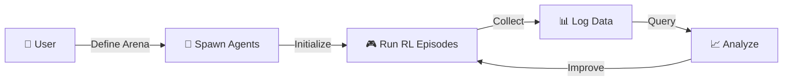

<div align="center">

```
    _____ _       _              ____           ____  _
   |  ___| |_   _(_)_ __   __ _ / ___|__ _ _ __|  _ \| |
   | |_  | | | | | | '_ \ / _` | |   / _` | '__| |_) | |
    |  _| | | |_| | | | | | (_| | |__| (_| | |  |  _ <| |___
    |_|   |_|\__, |_|_| |_|\__, |\____\__,_|_|  |_| \_\_____|
             |___/         |___/
```

```
                    🚁                    🛸
         🏢                    🏙️
    🏢  🏪  🏬              🛸      🏢
   🏛️ 🏦 🏢🏗️🏪      🚁        🏢 🏪
  🏢🏪🏛️🏬🏢🏗️🏦🏢   🛸    🏢🏗️🏪🏛️🏬
 ═══════════════════════════════════════
    T H E   F U T U R E   I S   H E R E
```

# 🚀 Autonomous eVTOL Training Simulator

### *Train AI pilots for the low-altitude economy*

[](https://www.python.org/)
[](https://www.nvidia.com/en-us/omniverse/)
[](https://pytorch.org/)
[](LICENSE)
[](CONTRIBUTING.md)

```
🛸 → 🏢 → 🛸 → 🏗️ → 🛸 → 🏙️ → 🛸
  Simulating Tomorrow's Urban Airways
```

</div>

---

## 📋 Table of Contents
- [🎯 Project Overview](#-project-overview)
- [✨ Key Features](#-key-features)
- [⚙️ Technical Specifications](#%EF%B8%8F-technical-specifications)
- [🏗️ Architecture Overview](#%EF%B8%8F-architecture-overview)
- [🛠️ Tech Stack](#%EF%B8%8F-tech-stack)
- [📦 Prerequisites](#-prerequisites)
- [🚀 Installation and Setup](#-installation-and-setup)
- [🗺️ Development Roadmap](#%EF%B8%8F-development-roadmap-and-tasks)
- [💻 Usage Guide](#-usage-guide)
- [🗄️ Data Management](#%EF%B8%8F-data-management-and-database)
- [🧪 Testing and Evaluation](#-testing-and-evaluation)
- [🤝 Contributing](#-contributing)
- [📄 License](#-license)
- [🙏 Acknowledgments](#-acknowledgments)

---

## 🎯 Project Overview

> **Welcome to the future of urban mobility!** 🛸✨

**FlyingCarRL** is an open-source, end-to-end simulation platform designed to develop, train, and evaluate neural networks for autonomous flying cars—specifically **electric Vertical Takeoff and Landing (eVTOL)** vehicles operating in low-altitude urban airspace (400-500 feet). Inspired by advancements in reinforcement learning (RL) for embodied AI, such as NVIDIA's Project GR00T for humanoids, this project adapts similar scalable simulation techniques to aerial mobility.

```
    🌍 Real-World Data  +  🎮 Game Engine Physics  +  🧠 Deep RL  =  🚁 Autonomous eVTOLs
```

At its core, FlyingCarRL creates a **photorealistic, physics-accurate 3D virtual world** using real-time Earth data (e.g., from Google Maps 3D Tiles via Cesium). Users can spawn fleets of customizable eVTOL vehicles (varying in size, shape, weight, and capabilities) into dynamic "arenas" representing urban environments. These vehicles learn via RL to navigate, avoid obstacles, optimize energy use, and coordinate in multi-agent scenarios—all while adhering to simulated airspace regulations.

### 🎯 Dual-Purpose Platform

| Purpose | Description |
|---------|-------------|
| 🔬 **Research & Development** | For AI enthusiasts, researchers, or startups prototyping autonomous aerial systems without real-world hardware risks or FAA approvals |
| 🎓 **Educational Platform** | Demonstrates integration of game engines, geospatial tech, physics simulation, and ML frameworks for 3D RL training |

### 🚀 What It Does

```
🛸 Simulates thousands of eVTOL agents in parallel for efficient RL training
🗺️ Integrates real-world geospatial data for "as-close-to-real-time" urban mapping
📊 Logs comprehensive data (sensors, trajectories, rewards) to database for analysis
📺 Provides visual frontend for monitoring, debugging, and visualizing learned policies
```

<div align="center">

**2025: The Low-Altitude Economy is Here** 🌆

*Aligning with urban air mobility initiatives by FAA and companies like Joby Aviation*

</div>

---

## ✨ Key Features

<div align="center">

```
╔══════════════════════════════════════════════════════════════════╗
║                    🎮 SIMULATION SUPERPOWERS 🚀                  ║
╚══════════════════════════════════════════════════════════════════╝
```

</div>

### 🌐 Scalable Multi-Agent Simulation
Train **1,000+ eVTOLs simultaneously** in GPU-accelerated environments, handling fleet coordination and emergent behaviors.
```
🛸 + 🛸 + 🛸 + ... × 1000 = 🌆 Full Urban Air Traffic!
```

### 🎨 Customizable Vehicle Fleet

| Type | Weight | Role | Emoji |
|------|--------|------|-------|
| **Small Scout** | 100kg | Agile reconnaissance | 🛸 |
| **Medium Passenger** | 500kg | Balanced transport | 🚁 |
| **Large Cargo** | 1,000kg | Heavy-lift delivery | 🚀 |

### 🌍 Photorealistic 3D World
Stream **real-time Earth data** (terrain, buildings, elevation) at 400-500 ft altitude, with dynamic elements like weather, wind, and traffic.

### 🧠 RL Training Pipeline
End-to-end support for policies like **navigation**, **collision avoidance**, and **landing**, using optimized libraries for fast iteration.

### 📊 Data Logging and Analytics
Store all simulation data (positions, sensor feeds, episode outcomes) in a flexible database for querying, visualization, and model improvement.

### 📺 Visual Frontend
Real-time viewer with dashboards for spawning agents, monitoring metrics, and replaying episodes.

### 🔌 Modular Extensions
Integrate with external tools for advanced physics (e.g., turbulence models) or hybrid ground-air scenarios.

### 🛡️ Safety and Compliance Sim
Enforce virtual **geofencing**, **no-fly zones**, and **energy constraints** to mimic real aviation regulations.

---

## ⚙️ Technical Specifications

<div align="center">

```
╔════════════════════════════════════════════════════════════╗
║  🎯 MAXIMUM PERFORMANCE  •  🔬 MAXIMUM REALISM  •  🚀     ║
╚════════════════════════════════════════════════════════════╝
```

</div>

| Specification | Details | Icon |
|---------------|---------|------|
| **🌐 Simulation Scale** | Up to **10,000 parallel agents** on high-end GPUs (NVIDIA A100)<br>100-500 on consumer hardware | 📈 |
| **✈️ Altitude Constraints** | Fixed to **400-500 ft** (Z-axis limits)<br>Dynamic adjustments for takeoff/landing | 📏 |
| **⚡ Physics Fidelity** | Real-time aerodynamics (thrust, drag, lift via PhysX/Omniverse)<br>Wind turbulence (Gaussian models)<br>Battery simulation (energy drain based on mass/thrust) | 🔋 |
| **📡 Sensor Emulation** | RGB/Depth cameras, LiDAR point clouds<br>IMU (accelerometers/gyros)<br>GPS with noise injection | 📷 |
| **🏆 RL Metrics** | ✅ Rewards: path efficiency, collision-free flights, altitude adherence<br>❌ Penalties: violations, crashes | 📊 |
| **⚡ Performance Targets** | **1M+ simulation steps/sec** (headless mode)<br>**60 FPS** (visual mode) | 🚄 |
| **💾 Data Volume** | Per episode (10-min): ~1GB raw sensor data<br>Aggregated logs: ~10MB per 100 agents | 🗄️ |
| **💻 Compatibility** | Windows/Linux (primary)<br>macOS (partial - no full Omniverse support) | 🖥️ |
| **🔒 Security** | Local-only by default<br>Optional cloud integration with encrypted data transfer | 🛡️ |

---

## 🏗️ Architecture Overview

<div align="center">

```
┌─────────────────────────────────────────────────────────────┐
│                   🎮 USER INTERFACE LAYER                    │
│          Omniverse Viewer  +  Streamlit Dashboard           │
└────────────────────────┬────────────────────────────────────┘
                         │
┌────────────────────────▼────────────────────────────────────┐
│                   🤖 ORCHESTRATION LAYER                     │
│        Python Scripts: Spawning, Training, DB Sync          │
└────────────┬───────────┬───────────┬───────────┬────────────┘
             │           │           │           │
┌────────────▼───┐ ┌────▼─────┐ ┌──▼────────┐ ┌▼─────────────┐
│ 🌍 Environment │ │ 🛸 Agent │ │ 🧠 Training│ │ 🗄️ Data      │
│     Layer      │ │  Layer   │ │   Layer    │ │   Layer      │
├────────────────┤ ├──────────┤ ├───────────┤ ├──────────────┤
│ • Isaac Lab   │ │ • eVTOL  │ │• PufferLib│ │ • SQLite     │
│ • Omniverse   │ │   USD    │ │• RLlib    │ │ • MySQL      │
│ • Cesium      │ │ • Gym    │ │• PyTorch  │ │ • CSV/Parquet│
│ • AirSim      │ │   Wrapper│ │           │ │              │
└────────────────┘ └──────────┘ └───────────┘ └──────────────┘
```

</div>

### 🔄 System Flow



### 🧱 Layer Breakdown

1. **🌍 Environment Layer**: NVIDIA Isaac Lab/Omniverse for core sim, extended with Cesium for geospatial mapping and AirSim APIs for aerial dynamics
2. **🛸 Agent Layer**: Custom eVTOL blueprints (USD assets) with RL interfaces (Gym/PettingZoo env wrappers)
3. **🧠 Training Layer**: PufferLib/RLlib for optimized RL algorithms; PyTorch backend for neural nets
4. **🗄️ Data Layer**: SQLite (dev) or MySQL (prod) for logging; optional export to CSV/Parquet for ML pipelines
5. **📺 UI/Frontend Layer**: Omniverse Viewer + custom Python dashboards (via Streamlit) for interaction
6. **⚙️ Orchestration**: Python scripts for spawning, training loops, and DB integration

---

## 🛠️ Tech Stack

<div align="center">

```
╔══════════════════════════════════════════════════════════╗
║          ⚡ POWERED BY CUTTING-EDGE TECH ⚡              ║
╚══════════════════════════════════════════════════════════╝
```

### 🎮 Simulation & Graphics


### 🧠 Machine Learning & RL


### 🗄️ Data & Database


### 💻 Programming & Tools


### ⚙️ Hardware


</div>

---

## 📦 Prerequisites

<div align="center">

```
╔════════════════════════════════════════════════════════╗
║         🚀 READY TO BUILD THE FUTURE? 🚀              ║
║            Here's what you'll need:                    ║
╚════════════════════════════════════════════════════════╝
```

</div>

| Requirement | Minimum | Recommended | Status |
|-------------|---------|-------------|--------|
| 🎮 **NVIDIA GPU** | RTX 3060 (8GB VRAM) | RTX 4090 / A100 | ⚡ |
| 💾 **CUDA** | 12.0+ | 12.3+ | 🔥 |
| 🐍 **Python** | 3.12 | 3.12+ | ✅ |
| 🌐 **Omniverse** | Latest | Latest + Isaac Lab | 🎯 |
| 📦 **Git** | Any version | Latest | 🔧 |
| 🐳 **Docker** | Optional (for MySQL) | Latest | 💡 |

---

## 🚀 Installation and Setup

### Step 1️⃣: Clone the Repository
```bash
git clone https://github.com/yourusername/FlyingCarRL.git
cd FlyingCarRL
```

### Step 2️⃣: Install Dependencies
```bash
pip install -r requirements.txt
```

### Step 3️⃣: Set Up NVIDIA Omniverse
```bash
# 1. Download from NVIDIA
🔗 https://www.nvidia.com/en-us/omniverse/

# 2. Install Isaac Lab
🔗 https://github.com/isaac-sim/IsaacLab

# 3. See detailed setup guide
📖 docs/omniverse_setup.md
```

### Step 4️⃣: Configure Cesium
```bash
# 1. Sign up for Cesium ion
🔗 https://cesium.com/ion/

# 2. Add API key to .env
cp .env.example .env
# Edit .env and add your CESIUM_ION_TOKEN

# 3. Run setup script
python scripts/setup_cesium.py
```

### Step 5️⃣: Initialize Database
```bash
python scripts/init_db.py
# Creates SQLite file or MySQL schema
```

### Step 6️⃣: Launch the Simulator! 🎉
```bash
# Visual mode (interactive)
python main.py --mode=visual

# Headless mode (training)
python main.py --mode=headless
```

<div align="center">

```
🎊 CONGRATULATIONS! 🎊
You're ready to train flying car AI!
```

</div>

---

## 🗺️ Development Roadmap and Tasks

<div align="center">

```
╔═══════════════════════════════════════════════════════════╗
║     🛤️  FROM ZERO TO FLYING CAR HERO 🛤️                 ║
║  Building the future, one phase at a time...              ║
╚═══════════════════════════════════════════════════════════╝
```

**Total Estimated Effort:** 22-46 person-days 💪

</div>

This comprehensive roadmap outlines all steps to build the project from scratch. Tasks are broken into phases with subtasks, dependencies, estimated effort, and milestones.

---

### 🏁 Phase 1: Project Setup and Core Environment (2-5 days) ✅

- **Task 1.1**: Initialize Git repo and structure folders (src/, scripts/, docs/, assets/).
  - Subtasks: Add .gitignore; commit initial README skeleton.
- **Task 1.2**: Install and configure NVIDIA Omniverse and Isaac Lab.
  - Subtasks: Follow NVIDIA docs; test basic humanoid sim to verify GPU accel.
  - Dependencies: NVIDIA account.
- **Task 1.3**: Integrate Cesium for geospatial data.
  - Subtasks: Add Cesium plugin; script to load Google 3D Tiles for a test city (e.g., NYC); constrain Z to 400-500 ft.
  - Effort: 1 day.
- **Task 1.4**: Set up basic arena environment.
  - Subtasks: Create USD scene with urban terrain; add procedural elements (buildings from OSM data).
  - **Milestone**: Render a static 3D map viewable in Omniverse.

---

### 🛸 Phase 2: Vehicle Modeling and Spawning (3-7 days) ✅

- **Task 2.1**: Define eVTOL blueprints.
  - Subtasks: Create 3 vehicle types (small: 100kg, sphere-like; medium: 500kg, winged; large: 1,000kg, boxy) using USD assets; parameterize mass, shape, thrust vectors.
- **Task 2.2**: Implement physics customizations.
  - Subtasks: Add aerodynamics (drag/lift equations); wind/turbulence models (using PhysX forces); battery sim (linear drain formula).
  - Dependencies: Phase 1.
- **Task 2.3**: Develop spawning system.
  - Subtasks: Python API to spawn N agents (user-defined count/types); "enter arena" logic (random start positions at 400 ft).
  - Effort: 2 days.
- **Task 2.4**: Add sensor emulation.
  - Subtasks: Integrate cameras/LiDAR/IMU; generate noisy data streams.
  - **🎯 Milestone**: Spawn and manually control 10 vehicles in sim.

---

### 🧠 Phase 3: RL Integration and Training Pipeline (5-10 days) ✅

- **Task 3.1**: Wrap sim as RL environment.
  - Subtasks: Use Gym/PettingZoo; define obs (sensors), actions (controls), rewards (safe flight at altitude).
- **Task 3.2**: Integrate PufferLib.
  - Subtasks: Clone repo; add wrappers for compatibility; optimize for multi-agent.
  - Dependencies: Phase 2.
- **Task 3.3**: Implement training loops.
  - Subtasks: Scripts for supervised/RL training; support PPO/DDPG algorithms; handle multi-vehicle coordination.
  - Effort: 3 days.
- **Task 3.4**: Add edge cases.
  - Subtasks: Script scenarios (bird strikes, GPS failures, weather changes).
  - **🎯 Milestone**: Train a basic policy for single-vehicle navigation.

---

### 📺 Phase 4: Frontend and UI Development (4-8 days) ✅

- **Task 4.1**: Build visual frontend.
  - Subtasks: Use Omniverse Viewer; add camera controls, agent highlighting.
- **Task 4.2**: Create dashboard.
  - Subtasks: Streamlit app for spawning, metric displays (rewards, trajectories); integrate live sim feeds.
  - Dependencies: Phase 3.
- **Task 4.3**: Implement replay system.
  - Subtasks: Save/load episodes; visualize paths in 3D.
  - Effort: 2 days.
- **Task 4.4**: Add user controls.
  - Subtasks: UI to select vehicle types, arena params, start/stop training.
  - **🎯 Milestone**: Interactive demo with 100 agents viewable in real-time.

---

### 🗄️ Phase 5: Data Logging and Database Integration (3-6 days) ✅

- **Task 5.1**: Design DB schema. ✅
  - Subtasks: Tables for episodes (id, vehicle_type, positions JSON, rewards), sensors (timestamps, data blobs), metrics.
- **Task 5.2**: Implement logging hooks. ✅
  - Subtasks: In sim loop, export data to SQLite (default); add MySQL switch for large-scale.
  - Dependencies: Phase 4.
- **Task 5.3**: Add querying tools. ✅
  - Subtasks: Scripts to query DB (e.g., avg reward per vehicle type); export to Pandas for analysis.
  - Effort: 2 days.
- **Task 5.4**: Handle data volume. ✅
  - Subtasks: Compression for blobs; indexing for fast queries; migration script from SQLite to MySQL.
  - **🎯 Milestone**: Log and query data from a full training run.

---

### 🚀 Phase 6: Testing, Optimization, and Deployment (5-10 days) ✅

- **Task 6.1**: Unit/integration tests. ✅
  - Subtasks: Test spawning, physics, RL convergence using pytest.
  - Completed: Comprehensive test suite with 50+ test cases, pytest configuration, fixtures.
- **Task 6.2**: Performance optimization. ✅
  - Subtasks: Profile GPU usage; enable distributed training (Ray cluster).
  - Completed: Profiling tools, GPU memory tracking, distributed training with Ray.
  - Dependencies: All prior.
- **Task 6.3**: Add compliance features. ✅
  - Subtasks: Virtual geofencing; simulate FAA rules (e.g., corridor paths).
  - Completed: No-fly zones, geofencing, altitude/speed limits, violation tracking.
  - Effort: 3 days.
- **Task 6.4**: Documentation and CI/CD. ✅
  - Subtasks: Expand this README; set up GitHub Actions for builds/tests.
  - Completed: GitHub Actions workflows, Phase 6 documentation, deployment guides.
- **Task 6.5**: Cloud deployment option. ✅
  - Subtasks: Dockerize; AWS/GCP scripts for GPU instances.
  - Completed: Dockerfile, Docker Compose, AWS EC2 scripts, GCP deployment scripts.
  - **🎯 Milestone**: Release v1.0 with end-to-end training example.

<div align="center">

```
╔═══════════════════════════════════════════════════════════╗
║  ✅ ALL PHASES COMPLETE! READY FOR PRODUCTION! ✅        ║
╚═══════════════════════════════════════════════════════════╝
```

**🔥 Prioritize phases sequentially; iterate based on testing 🔥**

</div>

---

## 💻 Usage Guide

### 🏋️ Training

Train eVTOL agents with different algorithms:

```bash
# 🚁 Basic training
python train.py --algo=PPO --vehicle-type=medium --total-timesteps=1000000

# 🚀 Training with custom settings
python main.py --mode=training --algo=DDPG --vehicle-type=large --timesteps=500000

# ⚡ Headless simulation (maximum speed!)
python main.py --mode=headless --agents=100 --episodes=1000 --db=sqlite
```

### 📺 Visualization

Launch the interactive dashboard:

```bash
# 🌆 Visual mode with Omniverse
python main.py --mode=visual --agents=50 --arena=NYC_Manhattan

# 📊 Streamlit dashboard
streamlit run dashboard.py
```

### 📊 Database Analysis

Query and analyze training data:

```bash
# 📈 Show database statistics
python scripts/analyze_db.py --stats

# 📝 View recent episodes
python scripts/analyze_db.py --episodes --vehicle-type=medium --limit=10

# 🏆 View performance metrics
python scripts/analyze_db.py --performance --vehicle-type=large

# 📊 Export training progress
python scripts/analyze_db.py --training-progress --vehicle-type=small --output=progress.csv

# 💾 Export episodes to CSV
python scripts/analyze_db.py --export-csv --output=episodes.csv --vehicle-type=medium

# 🔍 Custom SQL query
python scripts/analyze_db.py --query="SELECT * FROM episodes WHERE total_reward > 100"
```

### 🔄 Database Migration

Migrate from SQLite to MySQL for production:

```bash
# 🔍 Dry run (see what would be migrated)
python scripts/migrate_db.py --from-sqlite --to-mysql --dry-run

# 🚀 Actual migration
python scripts/migrate_db.py --from-sqlite --to-mysql --batch-size=1000

# ✅ Verify migration
python scripts/migrate_db.py --from-sqlite --to-mysql --verify-only
```

---

## 🗄️ Data Management and Database

The FlyingCarRL platform includes comprehensive database integration for logging and analyzing training data.

### 🌟 Database Features

<div align="center">

| Feature | Description | Icon |
|---------|-------------|------|
| **Dual Database Support** | SQLite (development) and MySQL (production) | 💾 |
| **Comprehensive Logging** | Episodes, metrics, sensor data, and training runs | 📊 |
| **Data Compression** | Automatic compression for trajectory and sensor data | 🗜️ |
| **Query Tools** | Command-line tools for analyzing training performance | 🔍 |
| **Migration Support** | Easy migration from SQLite to MySQL for scaling | 🔄 |

</div>

### 📋 Database Schema

The database includes the following tables:

```
📦 vehicles        → Vehicle type definitions (small, medium, large)
🌆 arenas          → Simulation environments (NYC, etc.)
📝 episodes        → Training episode records with rewards and outcomes
📊 metrics         → Per-timestep metrics (position, velocity, battery)
📡 sensor_logs     → Optional sensor data (camera, LiDAR, IMU, GPS)
🏃 training_runs   → Training run metadata and hyperparameters
```

### 💻 Using Database Logging

Integrate database logging into your training scripts:

```python
from src.database import DatabaseLogger
from src.database.callbacks import DatabaseLoggingCallback

# Create logger
db_logger = DatabaseLogger(db_type='sqlite')

# Use with Stable Baselines3
from stable_baselines3 import PPO

callback = DatabaseLoggingCallback(
    db_logger=db_logger,
    training_run_name="my_training_run",
    algorithm="PPO",
    vehicle_type="medium",
    hyperparameters={'learning_rate': 3e-4, 'batch_size': 64}
)

model.learn(total_timesteps=1000000, callback=callback)
```

### ⚡ Performance Considerations

<div align="center">

| Database | Use Case | Max Dataset | Concurrency | Icon |
|----------|----------|-------------|-------------|------|
| **SQLite** | Development | 100GB | Single-user | 🔧 |
| **MySQL** | Production | Unlimited | Multi-user + Replication | 🚀 |
| **Compression** | All | - | Reduces storage by 50-70% | 🗜️ |
| **Indexing** | All | - | Optimized queries | ⚡ |

</div>

---

## 🧪 Testing and Evaluation

### 🧬 Running Tests

FlyingCarRL includes a comprehensive test suite with 50+ test cases:

```bash
# 🧪 Run all tests
pytest tests/ -v

# 📦 Run specific test categories
pytest tests/ -v -m unit              # Unit tests only
pytest tests/ -v -m integration       # Integration tests only
pytest tests/ -v -m "not slow"        # Skip slow tests

# 📊 Run with coverage
pytest tests/ -v --cov=src --cov-report=html --cov-report=term

# 📈 View coverage report
open htmlcov/index.html
```

### ⚡ Performance Profiling

Profile training performance and identify bottlenecks:

```bash
# 🔍 Basic profiling
python scripts/profile_training.py --algo PPO --timesteps 10000

# 🎮 GPU memory profiling
python scripts/profile_training.py --algo DDPG --vehicle-type large --profile-memory

# 🚀 Distributed training
python scripts/distributed_training.py --num-workers 4 --num-gpus 2 --algo PPO
```

### 🛡️ Compliance Testing

Test compliance with aviation regulations:

```python
from src.utils.compliance import ComplianceManager, NoFlyZone

manager = ComplianceManager()
manager.create_default_zones(arena_bounds)

# Check compliance
result = manager.check_compliance(position, velocity, nearby_vehicles)
print(f"Compliant: {result['compliant']}")
print(f"Violations: {result['violations']}")
```

### 📏 Evaluation Metrics

<div align="center">

| Metric | Target | Icon |
|--------|--------|------|
| **Collision rate** | < 1% | 💥 |
| **Altitude compliance** | > 95% | ✈️ |
| **Speed compliance** | > 98% | 🚄 |
| **Training convergence** | < 10k episodes | 📈 |
| **No-fly zone violations** | 0 | 🚫 |
| **Minimum separation violations** | < 0.1% | ⚠️ |

</div>

### 🏆 Benchmarks

Compare policies vs. baselines:
```
🎲 Random flight
📜 Rule-based navigation
🤖 Pre-trained models
```

### 🛠️ Tools

<div align="center">


</div>

### ☁️ Cloud Deployment

Deploy to AWS or GCP for large-scale training:

```bash
# ☁️ AWS EC2 deployment
cd deploy/aws
bash deploy_ec2.sh

# ☁️ GCP deployment
cd deploy/gcp
bash deploy_gce.sh

# 🐳 Docker deployment (any cloud)
docker-compose up -d
```

📚 See `deploy/README.md` for detailed deployment instructions.

---

## 🤝 Contributing

<div align="center">

```
╔═══════════════════════════════════════════════════════╗
║        🚀 HELP BUILD THE FUTURE! 🚀                  ║
║  We welcome contributions from the community!        ║
╚═══════════════════════════════════════════════════════╝
```

**Fork → Code → PR → Merge**

</div>

- 🍴 Fork the repository
- 🎨 Follow code style (PEP8)
- ✅ Complete tasks from the roadmap
- 🐛 Issues welcome for feature requests (e.g., add more vehicle types)
- 🧪 Add tests for new features
- 📖 Update documentation

---

## 📄 License

<div align="center">

**MIT License**

Free to use/modify, with attribution ❤️

</div>

---

## 🙏 Acknowledgments

<div align="center">

```
Standing on the shoulders of giants 🏔️
```

Inspired by amazing open-source projects:

[](https://github.com/isaac-sim/IsaacLab)
[](https://puffer.ai/)
[](https://github.com/microsoft/AirSim)
[](https://cesium.com/)

**Thanks to the open-source communities advancing RL and simulation tech!** 🌟

</div>

---

<div align="center">

```
    🛸                    🚁
         🏢  🏗️  🏪           🛸
    🏢 🏛️ 🏬 🏢 🏦 🏪      🚁
   ═══════════════════════════════
      TRAIN SMART. FLY SAFE.
         THE FUTURE IS NOW.
```

**Made with ❤️ for the flying car revolution**

[](https://github.com/yourusername/FlyingCarRL)

</div>
